- [Competition](#competition)
- [Problem Statement](#problem-statement)
- [Dataset](#dataset)
- [Test Images Results](#test-images-results)

# Competition

Hackerearth competition page: [Esri Data Science Challenge 2019](https://www.hackerearth.com/challenges/hiring/esri-data-science-challenge-2019/)

---

# Problem Statement

Given an aerial image, we have to identify two objects: Pool and Car.

Now Car is present in almost all Object Detection datasets, but Pool may be or may not be supported.

Hence, we need to fine tune pretrained models on given dataset.

---

# Dataset

Dataset :  [Link](https://s3-ap-southeast-1.amazonaws.com/he-public-data/ESRI%20DATAc8fe593.zip)

We are given 3748 training images and 2703 testing images each may contain two objects Pool and Car.

Training Col 1 | Training Col 2
--------------------------- | ---------------------------
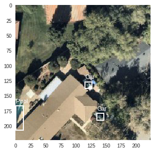 | 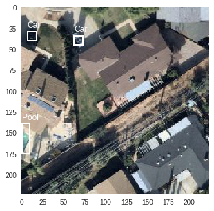
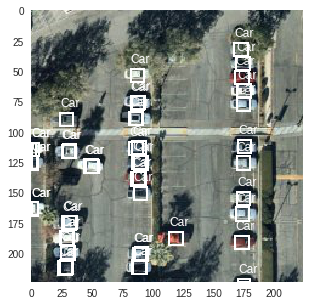 | 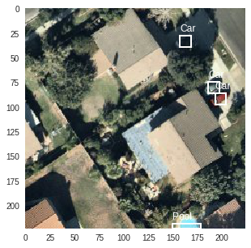

Testing Col 1 | Testing Col 2
--------------------------- | ---------------------------
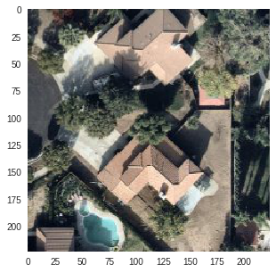 | 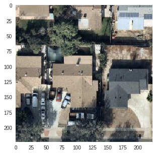
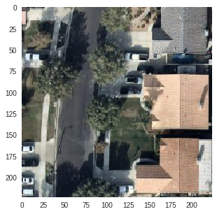 | 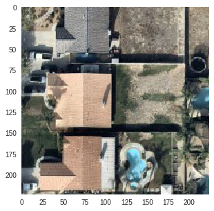
---

## Test Images Results

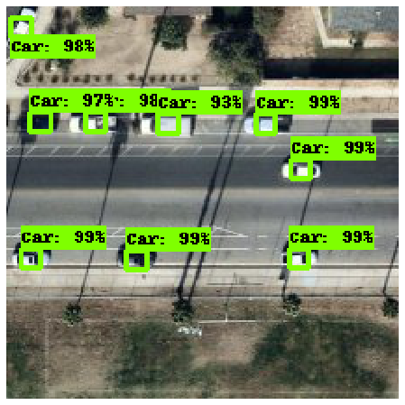

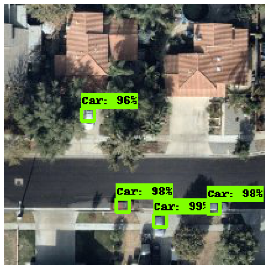

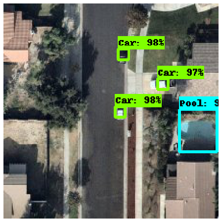

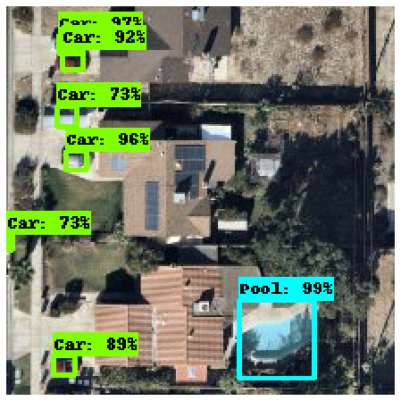
